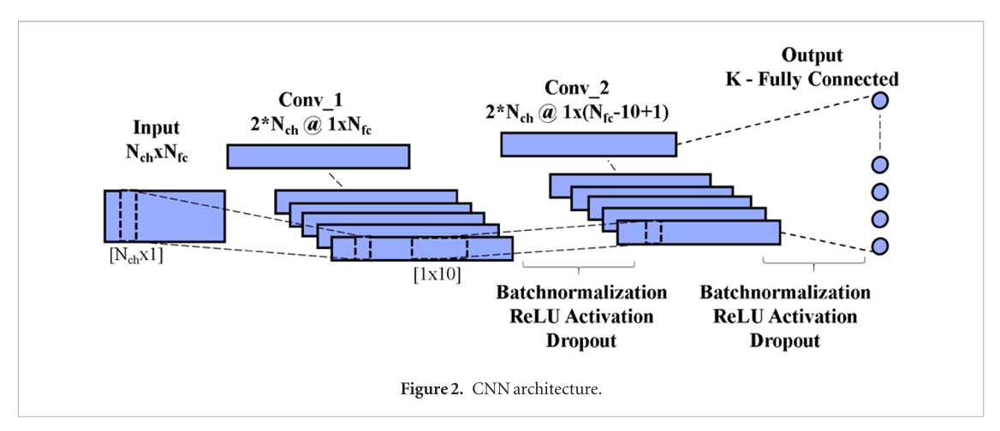
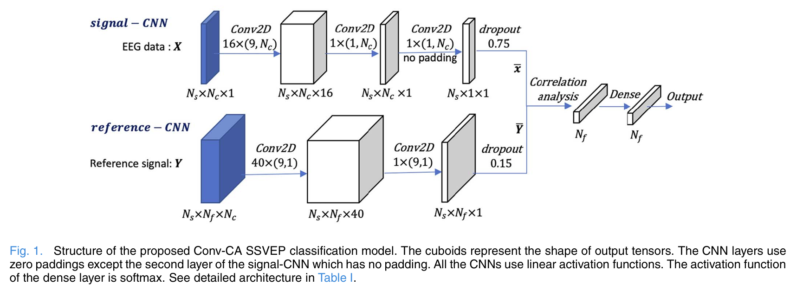
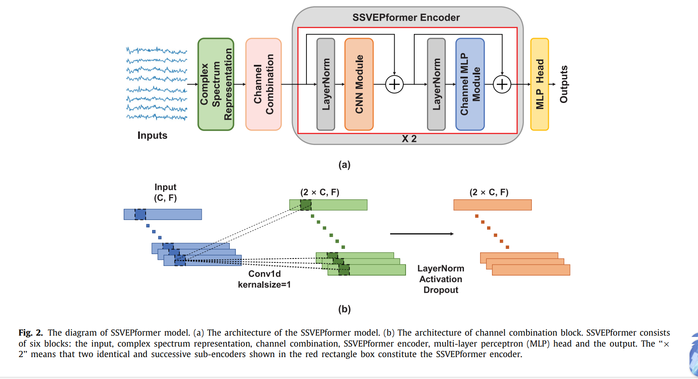
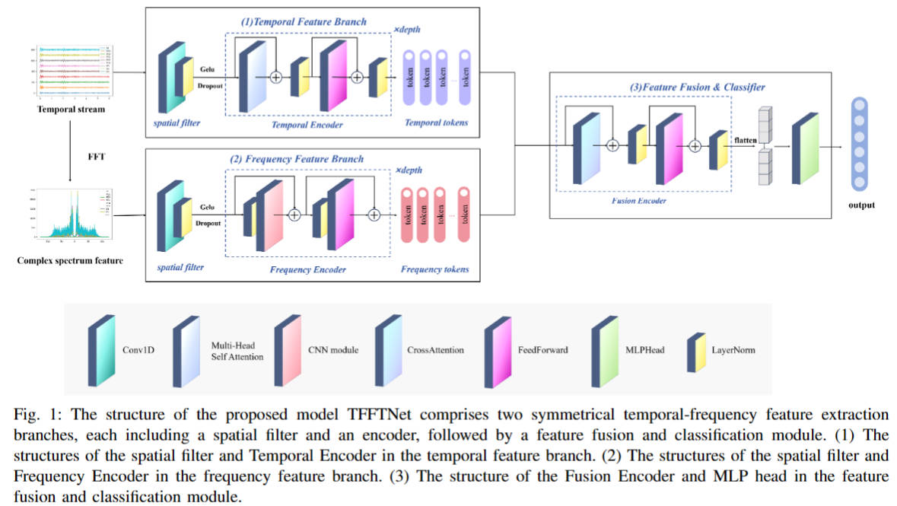

# Aim & Scope

稳态视觉诱发电位（SSVEP）是指当受试者持续凝视固定频率的闪烁或翻转刺激物时，在大脑枕叶-额叶区域诱发的与刺激频率相关的电生理信号。与 P300、运动想象（MI）和其他脑电信号相比，SSVEP 的信噪比更高，能产生更高的 ITR，因此长期以来一直是最有前途的脑电图范式之一。然而，传统的信号处理算法在解码 SSVEP 信号时依赖于人工特征提取，在各种极端情况（数据长度短、刺激数量多、校准数据数量少）下性能较差，无法满足行业的实际需求。深度学习技术作为人工智能的主要分支之一，已被应用于计算机视觉、自然语言处理、推荐系统等多个领域的研究。由于其强大的特征表达能力和极高的灵活性，它颠覆了这些领域的算法设计思路，并取得了令人瞩目的成果。

近年来，深度学习技术逐渐受到生物识别（BCI）领域研究人员的青睐。本资源库用于复现基于深度学习的 SSVEP 信号识别方法。复现的方法包括 EEGNet [1]-[2]、C-CNN [3]、FBtCNN [4]、ConvCA [5]、SSVEPNet [6]、SSVEPformer [7] 、 DDGCNN [8] 和TFFTNet [9]，并使用 12 类公共数据集 [10] 和 40 类公开数据集 [11] 进行评估。

# Model Introduction

- **EEGNet**: EEGNet is a convolutional neural network model specifically designed for processing EEG signal data, which receives time-domain EEG data as network input. EEGNet consists of 4 layers. The first layer is a convolutional layer that simulates bandpass filtering for each channel. The second layer is a spatial filtering layer that weights the data from each channel, achieved through depth-wise convolution. The third layer is a separate convolutional layer for extracting category information. The fourth layer is a fully connected layer for classification. Since its proposal, EEGNet has been used in various EEG tasks, such as motor imagery, P300, SSVEP, etc [1]-[2].


- **CCNN**: CCNN is also a convolutional neural network model. Differently, C-CNN uses frequency domain data rich in amplitude and phase information as network inputs. It is worth noting that in order to obtain the input of the network, CCNN uses a padding based FFT algorithm, which can obtain 220 data points at any data length, including 110 real part data and 110 imaginary part data. The CCNN network structure consists of two convolutional layers and a fully connected layer. The first convolutional layer is a spatial filtering layer, the second convolutional layer is a temporal filtering layer, and the fully connected layer is used for classification. The emergence of CCNN indicates that spectral data is beneficial for SSVEP classification [3].



- **FBtCNN**: Under the paradigm of frequency domain input, the features under short-term windows may not be obvious and the temporal differences of each channel may be ignored. Considering that there is a lot of effective information about frequency identification embedded in harmonic information, researchers have proposed a CNN architecture based on filter bank technology, termed as FBtCNN. FBtCNN uses time-domain signals as network inputs and uses filter banks to fuse feature information from different frequency bands to improve the classification performance of the network [4].


- **ConvCA**: The SSVEP signals collected from different electrode channels have a non-linear relationship with each other, and linear combination of EEG signals from multiple channels may not be the most accurate solution to classify SSVEPs. In order to further improve the performance of SSVEP-BCI, researchers have proposed a CNN based non-linear correlation analysis network , termed as ConvCA. ConvCA has two branches, one is a signal network that degrades multi-channel EEG signals into single-channel EEG signals, and the other is a reference network that interprets multi-channel reference signals into single-channel reference signals. ConvCA completes the classification process of SSVEP by analyzing the correlation between the signal network output and the reference network output.



- **SSVEPNet**: SSVEPNet is a hybrid network model of convolutional neural networks and long short-term memory networks, which accepts time-domain data as network input. SSVEPNet consists of three parts: convolutional neural network, long short-term memory network, and fully connected network. Among them, CNN is used to extract spatio-temporal features of EEG, a bidirectional LSTM is used for encoding based on the dependencies between spatio-temporal features, and a fully connected network consisting of three fully connected layers is used for final classification. In addition, in order to suppress possible overfitting during network training, spectral normalization and label based smoothing techniques were combined in the network implementation process to further improve the generalization of the model. SSVEPNet can still achieve very good classification performance even with only a small amount of calibration data, and this feature has been validated on 4-class, 12 class, and 40 class datasets.


- **SSVEPformer**: The Transformer based on attention mechanism has been applied in multiple fields such as CV and NLP, and has achieved remarkable results that have attracted worldwide attention. In recent years, Transformers have gradually been introduced into the decoding and analysis of EEG signals, revealing the potential application of Transformers in SSVEP-BCI systems. Due to the current dependence of SSVEP decoding algorithms on a large amount of subject calibration data, researchers have proposed the SSVEP classification network SSVEPformer based on Transformer to achieve zero calibration high-performance networks. The network inputs of SSVEPformer and C-CNN are consistent, using frequency domain signals as inputs, and combining CNN and MLP networks to complete the feature encoding and attention learning process of Transformer. SSVEPformer can achieve significant classification performance in cross-subject experiments, significantly outperforming other classification networks. In addition, combining filter bank technology, researchers have proposed an improved version of the network FB-SSVEPformer to further enhance network performance.



- **FBSSVEPformer** 无公开源码，自己复现的版本，涉及到子网络的训练
- **DDGCNN**: In the procedure of classification of multi-channel EEG, the processing of multi-channel electroencephalogram (EEG) data introduces challenges due to its non-Euclidean characteristic, necessitating methodologies that account for inter-channel topological relations.Thereinto, researchers introduced the Dynamic Decomposition Graph Convolutional Neural Network (DDGCNN) designed for the classification of SSVEP EEG signals. The DDGCNN incorporates layerwise dynamic graphs to address the oversmoothing issue in Graph Convolutional Networks (GCNs), employing a dense connection mechanism to mitigate the gradient vanishing problem. Furthermore, the DDGCNN enhance the traditional linear transformation inherent in GCNs with graph dynamic fusion, thereby elevating feature extraction and adaptive aggregation capabilities. The experimental results demonstrate the effectiveness of DDGCNN in learning and extracting features from EEG topological structure.


* **TFFTNet**: 对应文件名为TFFormer3，是由Chaobing Yang等提出的一个基于transformer的时频融合双分支网络。



# Running Environment

* Setup a virtual environment with python 3.8 or newer
* Install requirements

```
pip install -r Resource/requirements.txt
```
# Usage
./ect -配置文件夹目录，包括各种模型参数列表
./Model -模型文件夹，里面有各种模型的文件，代码是“模型类”
./Train -训练代码文件夹 配置训练一些方法函数
./Test -配置参数初始化，循环被试去训练、测试，画图(可视化结果)

# Train and Test

* Edit the config file (etc/config.yaml), choose the algorithm you want to run.
* Edit the config file, set the parameters for the training procedure and the specific hyperparameters for the algorithm.
* Run `Classifier_Test.py`

```
cd Test
python Classifier_Test.py
```

# Add New Model

1 ./Model create a model file

2 ./etc/config.yaml add model param

3 ./Train/Trainer_Script.py import model file and add net instantiation for the new model in data_process() and bulie_model()

4 ./Train/Classifier_Trainer.py add configuration information(if needed)

# Reference

[1] Lawhern V J, Solon A J, Waytowich N R, et al. EEGNet: a compact convolutional neural network for EEG-based brain–computer interfaces[J]. Journal of neural engineering, 2018, 15(5): 056013. <a href="https://iopscience.iop.org/article/10.1088/1741-2552/aace8c/meta">https://iopscience.iop.org/article/10.1088/1741-2552/aace8c/meta</a>

[2] Waytowich N, Lawhern V J, Garcia J O, et al. Compact convolutional neural networks for classification of asynchronous steady-state visual evoked potentials[J]. Journal of neural engineering, 2018, 15(6): 066031. <a href="https://iopscience.iop.org/article/10.1088/1741-2552/aae5d8/meta">https://iopscience.iop.org/article/10.1088/1741-2552/aae5d8/meta</a>

[3] Ravi A, Beni N H, Manuel J, et al. Comparing user-dependent and user-independent training of CNN for SSVEP BCI[J]. Journal of neural engineering, 2020, 17(2): 026028. <a href="https://iopscience.iop.org/article/10.1088/1741-2552/ab6a67/meta">https://iopscience.iop.org/article/10.1088/1741-2552/ab6a67/meta</a>

[4] Ding W, Shan J, Fang B, et al. Filter bank convolutional neural network for short time-window steady-state visual evoked potential classification[J]. IEEE Transactions on Neural Systems and Rehabilitation Engineering, 2021, 29: 2615-2624. <a href="https://ieeexplore.ieee.org/abstract/document/9632600/">https://ieeexplore.ieee.org/abstract/document/9632600/</a>

[5] Li Y, Xiang J, Kesavadas T. Convolutional correlation analysis for enhancing the performance of SSVEP-based brain-computer interface[J]. IEEE Transactions on Neural Systems and Rehabilitation Engineering, 2020, 28(12): 2681-2690. <a href="https://ieeexplore.ieee.org/abstract/document/9261605/">https://ieeexplore.ieee.org/abstract/document/9261605/</a>

[6] Pan Y, Chen J, Zhang Y, et al. An efficient CNN-LSTM network with spectral normalization and label smoothing technologies for SSVEP frequency recognition[J]. Journal of Neural Engineering, 2022, 19(5): 056014. <a href="https://iopscience.iop.org/article/10.1088/1741-2552/ac8dc5/meta">https://iopscience.iop.org/article/10.1088/1741-2552/ac8dc5/meta</a>

[7] Chen J, Zhang Y, Pan Y, et al. A Transformer-based deep neural network model for SSVEP classification[J]. Neural Networks, 2023, 164: 521-534. <a href="https://www.sciencedirect.com/science/article/abs/pii/S0893608023002319">https://www.sciencedirect.com/science/article/abs/pii/S0893608023002319</a>

[8] Zhang S, An D, Liu J, et al. Dynamic decomposition graph convolutional neural network for SSVEP-based brain–computer interface[J]. Neural Networks, 2024, 172: 106075.<a href="https://www.sciencedirect.com/science/article/abs/pii/S0893608023007360">https://www.sciencedirect.com/science/article/abs/pii/S0893608023007360</a>

[9] Chaobing Yang, Jiao Liang, Yongjian Chen, Hao Wang, Jiahui Pan. TFFTNet: Dual-Branch Transformer-Based Neural Network with Temporal-Frequency Fusion for SSVEP Classification

[10] Nakanishi M, Wang Y, Wang Y T, et al. A comparison study of canonical correlation analysis based methods for detecting steady-state visual evoked potentials[J]. PloS one, 2015, 10(10): e0140703. <a href="https://journals.plos.org/plosone/article?id=10.1371/journal.pone.0140703">https://journals.plos.org/plosone/article?id=10.1371/journal.pone.0140703</a>

[11] Luo, Ruixin, et al. "Almost free of calibration for SSVEP-based brain-computer interfaces." *Journal of Neural Engineering* 20.6 (2023): 066013. https://pubmed.ncbi.nlm.nih.gov/27849543/
